<div align="center">
  
</div>

<div align="center">
  
  
  
  
  
</div>

---

<div align="center">
  
</div>

## 🚀 About Me

```mermaid
graph TD
    A[🎓 CS Student] --> B[⚡ Nexoris.io Founder]
    B --> C[🛠️ AI/ML Engineer]
    C --> D[🌍 Global Expansion]
    D --> E[🔥 Building the Future]
    
    style A fill:#ff6b6b
    style B fill:#4ecdc4
    style C fill:#45b7d1
    style D fill:#96ceb4
    style E fill:#feca57
```

<div align="center">



</div>

- 🎓 **Computer Science** @ Sri Ramakrishna Engineering College, Coimbatore
- ⚡ **Founder** of [Nexoris.io](https://nexoris.io) - AI-driven solutions in healthcare, legal, and productivity
- 🛠️ Passionate about **Generative AI, ML engineering, and offline-first applications**
- 🌍 **Australia-bound** 🇦🇺 - Expanding globally
- 🧩 **Motto**: *Prototype fast. Ship faster. Refine always.*

---

## 🛠️ Tech Stack

<div align="center">

### Languages & Frameworks


</div>

### 🏷️ Badges

<div align="center">


</div>

---

## 📊 GitHub Analytics

<div align="center">

### 📈 Activity Overview

```mermaid
gitgraph
    commit id: "Initial"
    commit id: "Setup"
    branch feature/ai-platform
    checkout feature/ai-platform
    commit id: "AI Core"
    commit id: "ML Models"
    checkout main
    commit id: "Integration"
    merge feature/ai-platform
    commit id: "Deploy"
    branch feature/mobile-app
    checkout feature/mobile-app
    commit id: "Tauri Setup"
    commit id: "UI/UX"
    checkout main
    commit id: "Release"
    merge feature/mobile-app
```

</div>

<div align="center">


</div>

<div align="center">


</div>

---

## 🎯 Featured Projects

<div align="center">

### 🏗️ Project Architecture


</div>

### 🔥 Project Showcase

<table>
<tr>
<td width="50%">

#### 🏥 Aether Connect
**AI Telemedicine Platform**

- 🤖 AI-powered patient-doctor interactions
- 🎭 AR3D patient avatars
- 🔍 Diagnostic AI assistance
- 🔒 Secure telemedicine flows


</td>
<td width="50%">

#### 📚 Nexoris Documenter
**Knowledge Management System**

- 🖥️ Desktop-first (Tauri + SQLite)
- 📊 Graph-based insights
- 🧠 AI-powered connections
- 📝 PDF integration & flashcards


</td>
</tr>
<tr>
<td width="50%">

#### 🏥 Smart Health Surveillance
**Disease Prediction System**

- 🔮 ML-powered outbreak prediction
- 📊 Environmental data analysis
- 🎯 Real-time health monitoring
- 📈 Predictive analytics


</td>
<td width="50%">

#### 🚂 ITMS System
**Railway Track Monitoring**

- 📊 Streamlit dashboard
- 🔍 Anomaly detection
- 📈 Track geometry analysis
- 🎯 Real-time visualization


</td>
</tr>
</table>

---

## 🎨 Coding Philosophy

```mermaid
flowchart LR
    A[💡 Idea] --> B[🚀 Prototype]
    B --> C[🧪 Experiment]
    C --> D[📊 Analyze]
    D --> E[🔧 Refine]
    E --> F[📦 Ship]
    F --> G[🔄 Iterate]
    G --> A
    
    style A fill:#ff6b6b
    style B fill:#4ecdc4
    style C fill:#45b7d1
    style D fill:#96ceb4
    style E fill:#feca57
    style F fill:#ff9ff3
    style G fill:#54a0ff
```

<div align="center">



</div>

- **🛠️ Practical & Modular** → Always structure for reusability
- **📱 Offline-first** → Resilience through SQLite and desktop-first builds
- **🧪 Experiment-Oriented** → Build → Break → Improve → Scale
- **⚖️ Balanced Approach** → Low-level performance + High-level productivity
- **📚 Documentation-Driven** → Docs are as important as code

---

## 🌟 Vision & Philosophy

<div align="center">

> *"You're my constant, my North Star — guiding me no matter where I am."*

</div>

I bring this mindset into both **relationships** and **the projects I build** — seeking constancy, clarity, and direction in everything I do.

---

## 📫 Connect With Me

<div align="center">

[](https://nexoris.io)
[](https://linkedin.com/in/anvin)
[](https://twitter.com/anvin)
[](mailto:anvin@example.com)

</div>

---

<div align="center">
  
  
  
</div>

<div align="center">
  
  **🔥 Always building. Always learning. Always pushing limits.**
  
  
  
</div>
