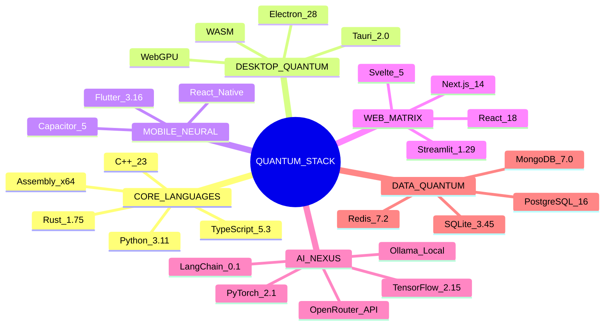
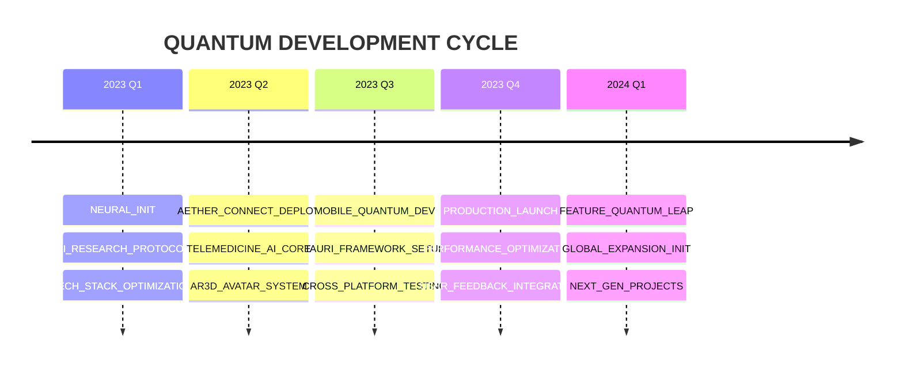
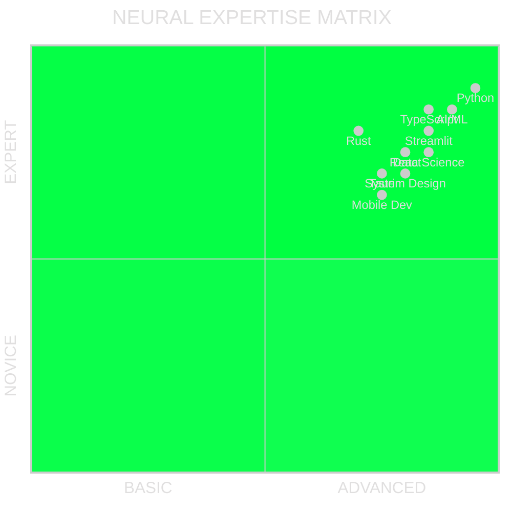

  

  
  
  
  
  

---

  

## ⚡ SYSTEM OVERVIEW

```mermaid
graph TD
    A[🎓 CS_NEURAL_NET] --> B[⚡ NEXORIS_OS]
    B --> C[🤖 AI_QUANTUM_CORE]
    C --> D[🌍 GLOBAL_EXPANSION_PROTOCOL]
    D --> E[🚀 FUTURE_ARCHITECT]
    
    style A fill:#001100
    style B fill:#003300
    style C fill:#005500
    style D fill:#007700
    style E fill:#00FF41
```

- 🎓 **NEURAL_NETWORK_TRAINING** @ Sri Ramakrishna Engineering College
- ⚡ **QUANTUM_BUILDER** of [Nexoris.io](https://nexoris.io) - Next-gen AI systems
- 🤖 **AI_ARCHITECT** specializing in Generative AI, ML Engineering, Offline-First Systems
- 🌍 **GLOBAL_EXPANSION** Protocol Active - Australia Node 🇦🇺
- 🧩 **CORE_PHILOSOPHY**: *Code → Deploy → Scale → Evolve*

---

## 🛠️ QUANTUM TECH STACK

### NEURAL PATHWAYS

```mermaid
mindmap
  root((QUANTUM_STACK))
    CORE_LANGUAGES
      Python_3.11
      Rust_1.75
      TypeScript_5.3
      C++_23
      Assembly_x64
    DESKTOP_QUANTUM
      Tauri_2.0
      Electron_28
      WebGPU
      WASM
    MOBILE_NEURAL
      Capacitor_5
      React_Native
      Flutter_3.16
    WEB_MATRIX
      Next.js_14
      React_18
      Streamlit_1.29
      Svelte_5
    AI_NEXUS
      PyTorch_2.1
      TensorFlow_2.15
      Ollama_Local
      OpenRouter_API
      LangChain_0.1
    DATA_QUANTUM
      SQLite_3.45
      PostgreSQL_16
      MongoDB_7.0
      Redis_7.2
```

### 🏷️ SYSTEM BADGES

---

## 📊 NEURAL ANALYTICS

### ⚡ SYSTEM TIMELINE

```mermaid
timeline
    title QUANTUM DEVELOPMENT CYCLE
    2023 Q1 : NEURAL_INIT
           : AI_RESEARCH_PROTOCOL
           : TECH_STACK_OPTIMIZATION
    2023 Q2 : AETHER_CONNECT_DEPLOY
           : TELEMEDICINE_AI_CORE
           : AR3D_AVATAR_SYSTEM
    2023 Q3 : MOBILE_QUANTUM_DEV
           : TAURI_FRAMEWORK_SETUP
           : CROSS_PLATFORM_TESTING
    2023 Q4 : PRODUCTION_LAUNCH
           : PERFORMANCE_OPTIMIZATION
           : USER_FEEDBACK_INTEGRATION
    2024 Q1 : FEATURE_QUANTUM_LEAP
           : GLOBAL_EXPANSION_INIT
           : NEXT_GEN_PROJECTS
```

---

## 🏆 QUANTUM ACHIEVEMENTS

---

## ⚡ CURRENT NEURAL PROCESSES

```mermaid
graph LR
    A[🚀 NEXORIS_OS] --> B[🌍 GLOBAL_DEPLOY]
    B --> C[🤖 AI_QUANTUM_CORE]
    C --> D[📱 MOBILE_NEURAL_NET]
    D --> E[🎯 AUSTRALIA_NODE]
    
    style A fill:#001100
    style B fill:#003300
    style C fill:#005500
    style D fill:#007700
    style E fill:#00FF41
```

**🔥 BUILDING THE NEXT GENERATION OF AI-POWERED SYSTEMS**

---

## 🎯 QUANTUM PROJECTS

### 🏗️ SYSTEM ARCHITECTURE

```mermaid
graph TB
    subgraph "AI_QUANTUM_PLATFORM"
        A[Aether Connect] --> B[Telemedicine AI Core]
        B --> C[AR3D Neural Avatars]
        C --> D[Diagnostic Quantum AI]
    end
    
    subgraph "DESKTOP_NEURAL_APPS"
        E[Nexoris Documenter] --> F[Tauri + SQLite Core]
        F --> G[Knowledge Graph Neural]
        G --> H[AI Insight Engine]
    end
    
    subgraph "DATA_QUANTUM_SCIENCE"
        I[Health Surveillance] --> J[ML Prediction Engine]
        J --> K[Outbreak Detection AI]
    end
    
    subgraph "WEB_NEURAL_APPS"
        L[ITMS Quantum System] --> M[Streamlit Neural Dashboard]
        M --> N[Track Analysis AI]
    end
    
    style A fill:#001100
    style E fill:#003300
    style I fill:#005500
    style L fill:#007700
```

### 🎯 NEURAL SKILLS MATRIX

```mermaid
%%{init: {'theme':'dark', 'themeVariables': { 'primaryColor': '#00FF41'}}}%%
quadrantChart
    title NEURAL EXPERTISE MATRIX
    x-axis "BASIC" --> "ADVANCED"
    y-axis "NOVICE" --> "EXPERT"
    
    "Python": [0.95, 0.9]
    "TypeScript": [0.85, 0.85]
    "React": [0.8, 0.75]
    "Rust": [0.7, 0.8]
    "AI/ML": [0.9, 0.85]
    "Tauri": [0.75, 0.7]
    "Streamlit": [0.85, 0.8]
    "Mobile Dev": [0.75, 0.65]
    "Data Science": [0.85, 0.75]
    "System Design": [0.8, 0.7]
```

### 🔥 QUANTUM SHOWCASE

<table>
<tr>
<td width="50%">

#### 🏥 Aether Connect
**AI Telemedicine Quantum Platform**

- 🤖 AI-powered patient-doctor neural interactions
- 🎭 AR3D quantum patient avatars
- 🔍 Diagnostic AI quantum assistance
- 🔒 Secure telemedicine neural flows

</td>
<td width="50%">

#### 📚 Nexoris Documenter
**Neural Knowledge Management System**

- 🖥️ Desktop-first (Tauri + SQLite Quantum Core)
- 📊 Graph-based neural insights
- 🧠 AI-powered quantum connections
- 📝 PDF integration & neural flashcards

</td>
</tr>
<tr>
<td width="50%">

#### 🏥 Smart Health Surveillance
**Disease Prediction Quantum System**

- 🔮 ML-powered outbreak prediction engine
- 📊 Environmental data neural analysis
- 🎯 Real-time health monitoring AI
- 📈 Predictive analytics quantum core

</td>
<td width="50%">

#### 🚂 ITMS Quantum System
**Railway Track Neural Monitoring**

- 📊 Streamlit neural dashboard
- 🔍 Anomaly detection AI
- 📈 Track geometry quantum analysis
- 🎯 Real-time visualization engine

</td>
</tr>
</table>

---

## 🎨 NEURAL PHILOSOPHY

```mermaid
flowchart LR
    A[💡 QUANTUM_IDEA] --> B[🚀 NEURAL_PROTOTYPE]
    B --> C[🧪 QUANTUM_EXPERIMENT]
    C --> D[📊 NEURAL_ANALYSIS]
    D --> E[🔧 QUANTUM_OPTIMIZE]
    E --> F[📦 NEURAL_DEPLOY]
    F --> G[🔄 QUANTUM_ITERATE]
    G --> A
    
    style A fill:#001100
    style B fill:#003300
    style C fill:#005500
    style D fill:#007700
    style E fill:#00AA00
    style F fill:#00CC00
    style G fill:#00FF41
```

- **🛠️ QUANTUM_MODULAR** → Neural architecture for maximum reusability
- **📱 OFFLINE_NEURAL_FIRST** → Quantum resilience through SQLite and desktop cores
- **🧪 EXPERIMENT_QUANTUM** → Build → Break → Optimize → Scale → Evolve
- **⚖️ NEURAL_BALANCE** → Low-level quantum performance + High-level neural productivity
- **📚 DOCUMENTATION_AI** → Neural docs are quantum code

---

## 🌟 QUANTUM VISION

> *"You're my quantum constant, my neural North Star — guiding me through every dimension."*

I channel this quantum mindset into both **neural relationships** and **the systems I architect** — seeking quantum constancy, neural clarity, and dimensional direction.

---

## 📫 NEURAL CONNECTIONS

---

  
  
  

---

## 📅 QUANTUM CALENDAR

---

  
  **🔥 QUANTUM_BUILDING. NEURAL_LEARNING. INFINITE_EVOLUTION.**
  
  
  

